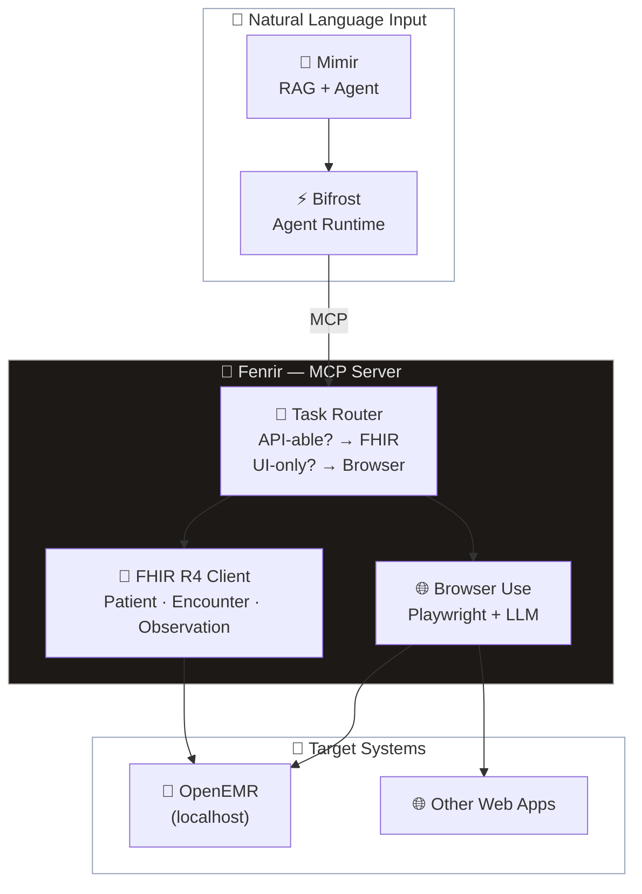

# 🐺 Fenrir — Computer Use Agent

> *The great wolf — AI-powered browser automation and clinic system integration for the Asgard ecosystem*

**Fenrir** is the computer-use component of the [Asgard AI Platform](https://github.com/megacare-dev/Asgard). It takes natural language commands and executes browser automation tasks, with a primary focus on **Eir (OpenEMR)** clinic management integration.

---

## 🏗️ Architecture

---

## 📦 Tech Stack

| Component | Technology | Purpose |
|:--|:--|:--|
| **MCP Server** | Python (FastAPI) | Tool interface for Bifrost |
| **Browser Automation** | [Browser Use](https://github.com/browser-use/browser-use) | Natural language → browser actions |
| **Browser Engine** | Playwright | Headless/headed browser control |
| **API Integration** | FHIR R4 Client (`fhirclient`) | Direct OpenEMR data operations |
| **LLM Backend** | Heimdall Gateway | Local LLM inference (Ollama/MLX) |

---

## 🎯 Use Cases

### Clinic Management (OpenEMR)

| Task | Method | Example |
|:--|:--|:--|
| Register patient | **FHIR API** | "ลงทะเบียนคนไข้ใหม่ นายสมชาย อายุ 45 ปี" |
| Record vitals | **FHIR API** | "บันทึก BP 120/80 HR 72 Temp 36.5" |
| Create encounter | **FHIR API** | "สร้าง visit ใหม่สำหรับ HN 12345" |
| Fill complex forms | **Browser Use** | "กรอกแบบฟอร์มส่งตัวผู้ป่วย" |
| Generate reports | **Browser Use** | "พิมพ์ใบสรุปการรักษา" |

### General Browser Automation

- Web scraping and data extraction
- Form filling across any web application
- Automated testing and QA

---

## 🔒 Security

> [!CAUTION]
> **Patient data must never leave the local machine.**

| Security Measure | Description |
|:--|:--|
| **Localhost only** | Fenrir listens on `127.0.0.1:8200` only |
| **Local LLM** | All inference via Heimdall → Ollama/MLX (no cloud API for patient data) |
| **FHIR Auth** | OAuth2 + OpenID Connect for OpenEMR API |
| **Sandbox** | Browser Use runs in isolated workspace |
| **No external data** | Patient information never sent to external APIs |

---

## 🔧 Configuration

| Setting | Default | Description |
|:--|:--|:--|
| `FENRIR_PORT` | `8200` | MCP server port |
| `OPENEMR_URL` | `http://localhost:80` | OpenEMR base URL |
| `OPENEMR_FHIR_URL` | `http://localhost:80/apis/default/fhir` | FHIR R4 endpoint |
| `HEIMDALL_URL` | `http://localhost:8080` | LLM Gateway |
| `BROWSER_HEADLESS` | `true` | Run browser in headless mode |

---

## 🗺️ Roadmap

- [ ] Project scaffold (FastAPI + MCP Server)
- [ ] FHIR R4 client for OpenEMR (Patient CRUD)
- [ ] Browser Use integration (natural language → browser actions)
- [ ] MCP tool definitions (browser_navigate, form_fill, fhir_create_patient, etc.)
- [ ] OpenEMR form mapping (encounter, vitals, prescriptions)
- [ ] Integration testing with Bifrost

---

## 📚 Related

- [Asgard AI Platform](https://github.com/megacare-dev/Asgard) — Ecosystem overview
- [Heimdall](https://github.com/megacare-dev/Heimdall) — LLM Gateway
- [Mimir](https://github.com/megacare-dev/Mimir) — RAG + Agent Builder
- [Bifrost](https://github.com/megacare-dev/Bifrost) — Agent Runtime
- [Browser Use](https://github.com/browser-use/browser-use) — Browser automation framework
- [OpenEMR](https://www.open-emr.org/) — Open-source clinic management

---

## 📄 License

**AGPL-3.0** — See [LICENSE](LICENSE)

© 2026 MegaWiz
