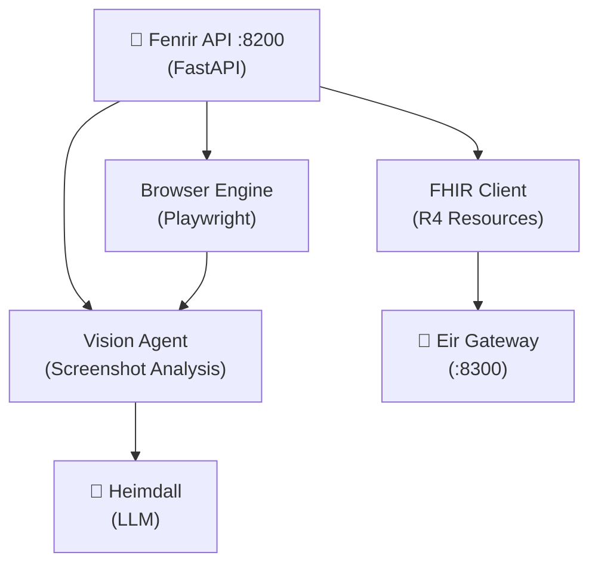

# SI-01: Software Implementation Report — Fenrir

**Product:** 🐺 Fenrir (Computer-Use Agent)
**Document ID:** SI-RPT-FENRIR-001
**Version:** 0.1.0
**Date:** 2026-03-18
**Standard:** ISO/IEC 29110 — SI Process
**Stack:** 🐍 Python (FastAPI + Playwright)

---

## 1. Product Overview

| Field | Value |
|:--|:--|
| **Repository** | MegaWiz-Dev-Team/Fenrir |
| **Port** | `:8200` |
| **Container** | `asgard_fenrir` |
| **Dependencies** | Bifrost (Agent Runtime), Heimdall (LLM), Eir Gateway (FHIR) |

---

## 2. Architecture

## 3. Functional Requirements

| FR | Description | Status |
|:--|:--|:--|
| FR-F01 | Browser automation (Playwright) | ✅ Done |
| FR-F02 | FHIR R4 client (Patient, Encounter) | ✅ Done |
| FR-F03 | Screenshot capture & analysis | ✅ Done |
| FR-F04 | LLM-guided browsing | ✅ Done |
| FR-F05 | OpenEMR integration via Eir GW | ✅ Done |

## 4. API Endpoints

| Method | Path | Description |
|:--|:--|:--|
| `GET` | `/health` | Health check |
| `POST` | `/api/browse` | Execute browser task |
| `GET` | `/api/fhir/Patient` | Query FHIR patients |
| `POST` | `/api/screenshot` | Capture & analyze page |

## 5. Configuration

| Variable | Default | Description |
|:--|:--|:--|
| `FENRIR_PORT` | `8200` | Port |
| `HEIMDALL_URL` | `http://localhost:8080` | LLM Gateway |
| `OPENEMR_URL` | `http://eir-gateway:8300` | Eir Gateway |
| `BROWSER_HEADLESS` | `true` | Headless browser |

---

*บันทึกโดย: AI Assistant (ISO/IEC 29110 SI Process)*
*Created: 2026-03-18 by Antigravity*
