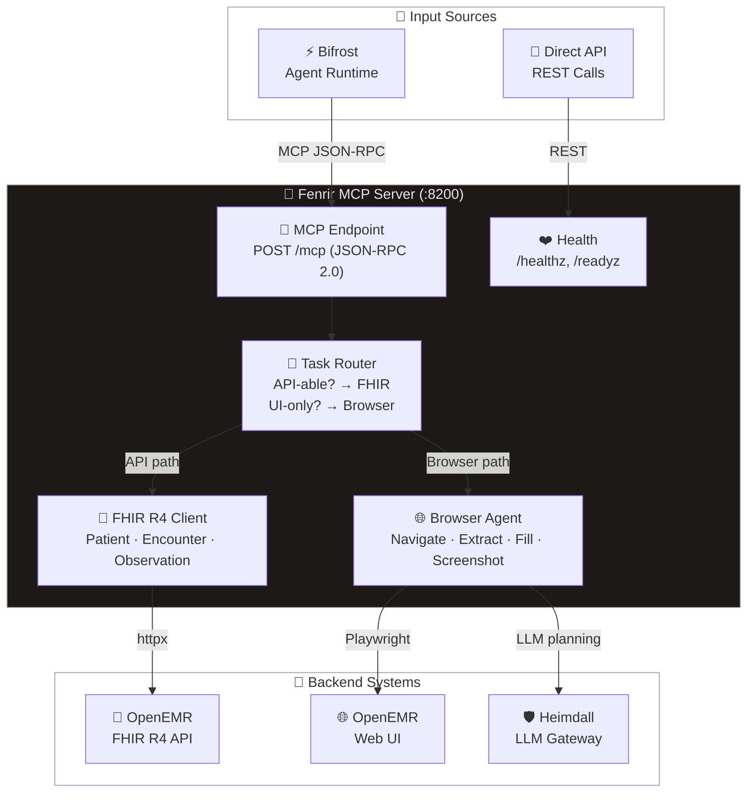

# SI-02: Software Design Document (SDD)
**Project Name:** Fenrir — Computer-Use Agent
**Document Version:** 1.0
**Date:** 2026-03-12
**Standard:** ISO/IEC 29110 — SI Process

---

## 1. System Architecture (สถาปัตยกรรมระบบ)

- **Runtime:** Python 3.11+
- **Web Framework:** FastAPI + Uvicorn
- **Browser Engine:** Browser Use + Playwright (Chromium)
- **FHIR Client:** httpx (async HTTP)
- **LLM Backend:** Heimdall Gateway → Ollama/MLX (localhost)
- **Configuration:** pydantic-settings (.env support)

### Architecture Diagram



---

## 2. Package Structure (โครงสร้างโมดูล)

```
fenrir/
├── __init__.py          # Package + version
├── config.py            # Settings (pydantic-settings)
├── main.py              # FastAPI app factory + lifespan
├── api/
│   ├── __init__.py
│   ├── health.py        # /healthz, /readyz
│   └── mcp.py           # POST /mcp (JSON-RPC 2.0)
├── fhir/
│   ├── __init__.py
│   ├── client.py        # FHIRClient (httpx async)
│   └── models.py        # Pydantic FHIR models
└── browser/
    ├── __init__.py
    ├── agent.py          # BrowserAgent (Playwright)
    └── tasks.py          # TaskRouter (FHIR vs Browser)
```

---

## 3. Component Design (การออกแบบส่วนประกอบ)

### 3.1 MCP Server (`api/mcp.py`)
- **Protocol:** JSON-RPC 2.0 (matching MCP spec 2024-11-05)
- **Methods:** `initialize`, `tools/list`, `tools/call`
- **Tools registered:** 5 (2 browser + 3 FHIR)
- **Error handling:** JSON-RPC error codes (-32601 method not found, -32603 internal)

### 3.2 FHIR Client (`fhir/client.py`)
- **Transport:** httpx AsyncClient (connection pooling)
- **Auth:** Bearer token (configurable)
- **Endpoints:** Patient search/get/create, Observation get
- **Error handling:** HTTP status → structured error dict

### 3.3 Browser Agent (`browser/agent.py`)
- **Engine:** Playwright Chromium (headless by default)
- **Security:** `is_allowed_url()` → localhost/127.0.0.1/.local only
- **Operations:** navigate, extract, fill_form, screenshot
- **Timeout:** 15s per navigation

### 3.4 Task Router (`browser/tasks.py`)
- **Strategy:** API-first (FHIR preferred when available)
- **Patterns:** Keyword matching (Thai + English)
- **Fallback:** Browser automation for unrecognized tasks
- **Output:** `TaskRouteResult(method, tool_name, reason, params)`

---

## 4. Security Design (การออกแบบด้านความปลอดภัย)

| Measure | Implementation |
|:--|:--|
| **Localhost lock** | `is_allowed_url()` — blocks all non-local URLs |
| **Local LLM only** | Heimdall → Ollama/MLX (no cloud for patient data) |
| **FHIR Auth** | Bearer token in `Authorization` header |
| **Browser sandbox** | Playwright isolated context per operation |
| **No external data** | Patient information never leaves localhost |

---

## 5. Configuration (ตัวแปรสภาพแวดล้อม)

| Variable | Default | Description |
|:--|:--|:--|
| `FENRIR_HOST` | `127.0.0.1` | Server bind address |
| `FENRIR_PORT` | `8200` | Server port |
| `LOG_LEVEL` | `info` | Logging level |
| `OPENEMR_URL` | `http://localhost:80` | OpenEMR base URL |
| `OPENEMR_FHIR_URL` | `http://localhost:80/apis/default/fhir` | FHIR R4 endpoint |
| `OPENEMR_AUTH_TOKEN` | *(empty)* | FHIR Bearer token |
| `HEIMDALL_URL` | `http://localhost:8080` | LLM Gateway URL |
| `BROWSER_HEADLESS` | `true` | Headless browser mode |

---

*บันทึกโดย: AI Assistant (ตามมาตรฐาน ISO/IEC 29110 หมวด SI-02)*
